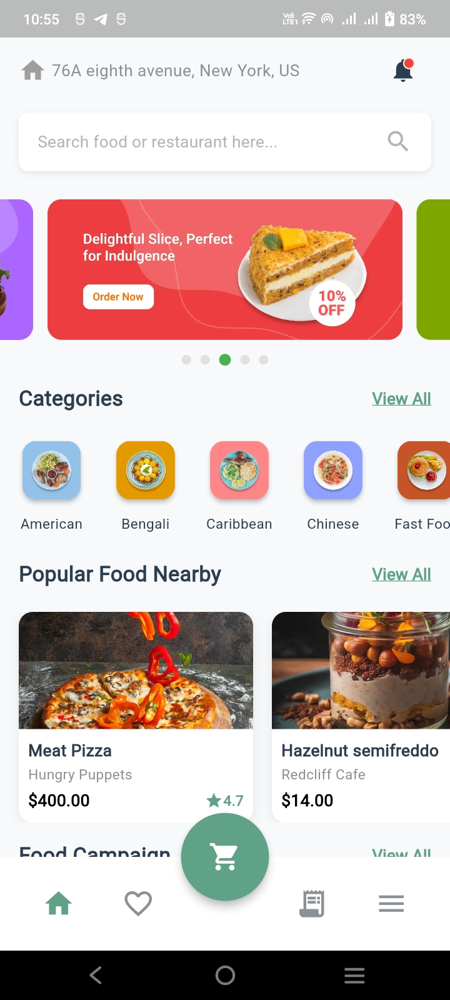
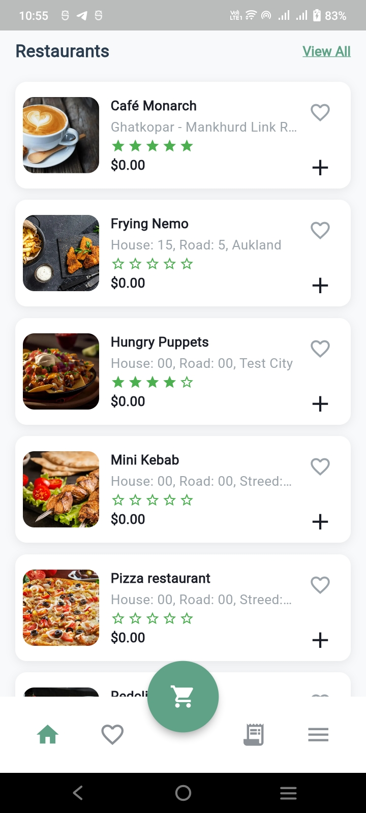

# StackFood App

A modern food delivery application built with Flutter, featuring a pixel-perfect UI design and clean architecture using GetX state management.

## 📱 Features

- **Home Screen**: Beautiful and responsive home page with multiple sections
- **Banner Carousel**: Auto-playing image carousel for promotions
- **Categories**: Browse food categories with smooth horizontal scrolling
- **Popular Food**: Discover trending food items nearby
- **Food Campaigns**: Special offers and discounts on food items
- **Restaurants**: Comprehensive list of restaurants with pagination
- **Responsive Design**: Optimized for mobile, tablet, and web platforms
- **State Management**: Efficient state management using GetX
- **API Integration**: RESTful API integration with proper error handling
- **Image Caching**: Fast image loading with cached_network_image
- **Loading States**: Shimmer loading effects for better UX

## 🏗️ Architecture

The app follows a clean and scalable architecture:

```
lib/
├── app/
│   ├── data/
│   │   ├── constants/      # App constants (colors, strings, dimensions, API)
│   │   ├── models/         # Data models (Config, Banner, Category, Product, etc.)
│   │   └── services/       # API service layer
│   └── modules/
│       └── home/
│           ├── controllers/  # GetX controllers (ConfigController, HomeController)
│           ├── views/        # UI pages (HomePage)
│           └── widgets/      # Reusable widgets (Cards, Shimmer, etc.)
└── main.dart               # App entry point
```

## 🔌 API Endpoints

The app integrates with the following StackFood Admin API endpoints:

- **Base URL**: `https://stackfood-admin.6amtech.com`
- **Configuration**: `/api/v1/config` - Get app configuration and image base URLs
- **Banners**: `/api/v1/banners` - Fetch promotional banners
- **Categories**: `/api/v1/categories` - Get food categories
- **Popular Food**: `/api/v1/products/popular` - Fetch popular food items
- **Food Campaigns**: `/api/v1/campaigns/item` - Get active campaigns
- **Restaurants**: `/api/v1/restaurants/get-restaurants/all?offset=1&limit=10` - Fetch restaurants (paginated)

### API Headers

```json
{
  "Content-Type": "application/json; charset=UTF-8",
  "zoneId": "[1]",
  "latitude": "23.735129",
  "longitude": "90.425614"
}
```

## 📦 Dependencies

Key packages used in this project:

- `get: ^4.6.6` - State management and dependency injection
- `http: ^1.2.0` - HTTP client for API calls
- `cached_network_image: ^3.3.1` - Image caching
- `shimmer: ^3.0.0` - Loading shimmer effects
- `font_awesome_flutter: ^10.7.0` - Icon library
- `url_launcher: ^6.2.5` - Launch external URLs
- `intl: ^0.19.0` - Internationalization and formatting

**Note**: The banner carousel uses Flutter's built-in `PageView` widget for better compatibility with Flutter 3.13+

## 🚀 Getting Started

### Prerequisites

- Flutter SDK (3.5.4 or higher)
- Dart SDK
- Android Studio / VS Code
- Git

### Installation

1. **Clone the repository**
   ```bash
   git clone https://github.com/Md-Sakibul-Hasan/stackfood_app.git
   cd stackfood_app
   ```

2. **Install dependencies**
   ```bash
   flutter pub get
   ```

3. **Run the app**
   
   For mobile (Android/iOS):
   ```bash
   flutter run
   ```
   
   For web:
   ```bash
   flutter run -d chrome
   ```
   
   For a specific device:
   ```bash
   flutter devices
   flutter run -d <device_id>
   ```

## 📸 Screenshots

The app showcases a modern and intuitive user interface:

### Screenshot 1


### Screenshot 2


*Screenshots demonstrate the pixel-perfect implementation of the design with smooth animations and responsive layouts.*

## 🎥 Video Demonstration

Watch the complete app demonstration showcasing all features and functionality:

### App Demo Video

https://github.com/Md-Sakibul-Hasan/stackfood_app/assets/videos/app_video.mp4

> **Note**: If the video doesn't play above, you can [download it here](assets/videos/app_video.mp4) or view it directly in the repository at `assets/videos/app_video.mp4`

**Video Highlights:**
- Home screen with banner carousel auto-play (3-second intervals)
- Categories horizontal scrolling
- Popular food items display
- Food campaigns with discount badges
- Restaurant list with pull-to-refresh pagination
- Responsive design across different screen sizes
- API integration and real-time data loading

*The video demonstrates all major features including data loading and error handling.*

## 🎨 UI Design

The app features a pixel-perfect implementation of the provided design mockup with:

- **Color Scheme**: Orange primary color (#5FA287) with complementary colors
- **Typography**: Clean and readable font hierarchy
- **Cards**: Elegant card designs with shadows and rounded corners
- **Icons**: Custom category icons and Font Awesome icons
- **Spacing**: Consistent padding and margins throughout
- **Responsive**: Adapts beautifully to different screen sizes

## 🧪 Code Quality

- **Clean Code**: Well-structured and maintainable code with meaningful variable and function names
- **Error Handling**: Comprehensive error handling for API requests with user-friendly messages
- **Null Safety**: Full null safety implementation across the entire codebase
- **Comments**: Clear comments and documentation explaining complex logic and business rules
- **Reusable Widgets**: Modular and reusable UI components for better maintainability
- **State Management**: Proper reactive state management with GetX for optimal performance
- **API Service Layer**: Centralized API service with proper error handling and response parsing
- **Code Documentation**: Detailed inline comments for clarity and future maintenance
- **Best Practices**: Follows Flutter and Dart best practices and coding conventions
- **Const Constructors**: Optimized widget tree with const constructors where applicable
- **Performance Optimization**: Efficient image caching and minimal widget rebuilds

### Code Documentation Highlights

The codebase includes extensive comments for:
- **API Integration**: Detailed notes on endpoints, parameters, and response handling
- **Business Logic**: Explanations of pagination, data filtering, and state updates
- **UI Components**: Widget composition and layout structure documentation
- **Error Scenarios**: Handling of edge cases and fallback mechanisms
- **Configuration**: API headers, zone IDs, and location parameters

## 📋 Submission Checklist

This project meets all submission requirements:

- ✅ **Git Repository**: Hosted on GitHub with complete version control history
- ✅ **Detailed README**: Comprehensive documentation with setup instructions, architecture overview, and API details
- ✅ **Code Comments**: Extensive inline comments and documentation throughout the codebase
- ✅ **Screenshots**: Multiple screenshots showcasing all major features (located in `assets/screenshots/`)
- ✅ **Video Demo**: Complete app demonstration video (located in `assets/videos/`)
- ✅ **Clean Architecture**: Well-organized folder structure following best practices
- ✅ **Working Features**: All required features implemented and fully functional
- ✅ **Error Handling**: Robust error handling with fallback mechanisms
- ✅ **Responsive Design**: Optimized for mobile, tablet, and web platforms

## 📱 Responsive Design

The app is fully responsive and works seamlessly on:

- **Mobile Phones** (< 600px)
- **Tablets** (600px - 900px)
- **Desktops/Web** (> 900px)

Categories and other sections automatically adjust their layout based on screen size.

## 🔄 State Management

The app uses **GetX** for state management, providing:

- **Reactive Programming**: Automatic UI updates when data changes
- **Dependency Injection**: Easy controller management
- **Route Management**: Simple navigation
- **Performance**: Minimal rebuilds and efficient memory usage

### Controllers

- **ConfigController**: Manages app configuration and image base URLs
- **HomeController**: Handles home page data (banners, categories, foods, campaigns, restaurants)

## 🐛 Error Handling

The app includes robust error handling:

- Network request failures
- Empty data states
- Image loading errors
- API response validation
- User-friendly error messages
- **Fallback Data**: If the banner API response is empty or fails, the app automatically uses fallback banner data to ensure the carousel always displays content

## 🔄 Fallback Banner Data

When the banner API endpoint returns an empty response or fails, the app uses predefined fallback data containing 5 banners:

1. **Offer** - Restaurant promotion banner
2. **Fast Delivery** - Quick delivery service banner  
3. **Local** - Local cuisine banner
4. **Korean Food** - Korean restaurant banner
5. **Biryani** - Special biryani promotion banner

This ensures users always see promotional content even when the API is unavailable.

## 🌐 Web Support

The app is fully optimized for web with:

- Responsive layouts
- Touch and mouse interactions
- Fast loading times
- Cross-browser compatibility

## 📄 License

This project is created as part of a Flutter development assessment.

## 👨‍💻 Developer

**Md Sakibul Hasan**
- GitHub: [@Md-Sakibul-Hasan](https://github.com/Md-Sakibul-Hasan)

## 📞 Support

For any questions or issues, please open an issue on the GitHub repository.

---

**Happy Coding! 🚀**
